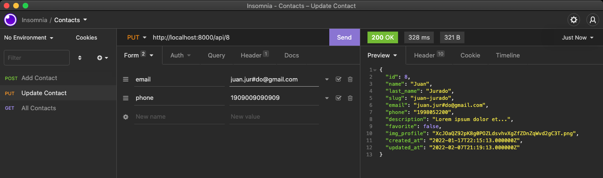

# Lista de Contatos 📔

 Uma simples aplicação de Lista de Contatos usando Laravel com Vue JS.

 - Etapa 1: Removendo o front criado com laravel e transportando para o Vue.

 No terminal após de instalar o laravel é preciso inserir o <code>larave/ui</code> através do comando:

 > <code>composer require laravel/ui</code>

 Após a instalação você insere o comando:

 > <code>php artisan ui vue</code>

 E após isso você pode usar seu gerenciador de dependências favorito, seja o npm ou o yarn para iniciar os pacotes vindo do <code>larave/ui</code>

 - Etapa 2: migrando todas as funcionalidades para a API.

 

 Todos os meios de retorno serão entregues via Json para após isso fazer as *promises* em axios via vue.

 - Etapa 3: Em processo...